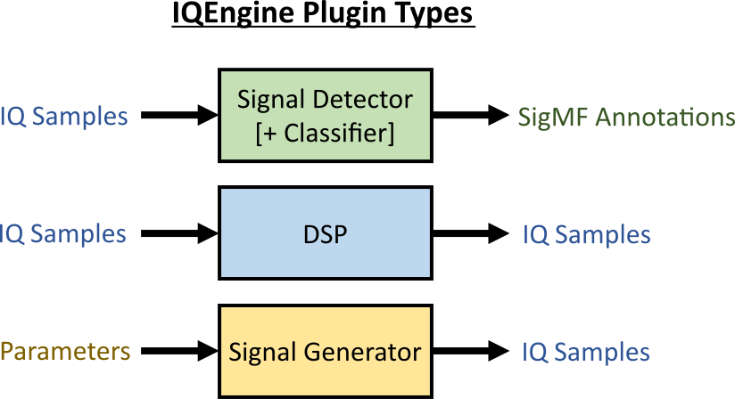

  

_
<a href="https://www.iqengine.org">www.iqengine.org</a>
_

<h4 style="text-align: center;"><i>A web-based SDR toolkit for analyzing, processing, and sharing RF recordings</i></h4>

* Spectrogram-based visualization and editor tool, built on SigMF
* Share your RF recordings or RFML datasets with others, without them having to download files or install any software
* IQEngine only fetches the portion of the samples you're viewing, allowing you to quickly browse very large RF recordings
* Test signal detection algorithms and visualize results
* Interactively earn about different Fourier and wavelet transforms and filters by applying them to interesting signals
* Organize and search through millions of RF recordings via metadata queries

Try IQEngine now using the canonical instance at [www.iqengine.org](http://iqengine.org/) hosted by [GNU Radio](https://www.gnuradio.org/) and connected to the official [SigMF](https://github.com/gnuradio/SigMF) examples repository.  You can use the same website to open local RF recordings, the processing is all done client-side.

IQEngine is rapidly evolving, so [sign up](https://dashboard.mailerlite.com/forms/299501/77960409531811734/share) for a once-a-month email update, including new features, demos, and more!  There is also an IQEngine [Discord](https://discord.gg/CUER5P3J) chat channel if you want to get involved in the development.  You may also contact Marc at iqengine@vt.edu for questions/comments/suggestions.

## Plugins

Through the backend API, IQEngine supports three different classes of plugins (signal generation is not yet released).  The signal detector (with optional classifier) can be triggered in the main spectrogram page, which will display the output annotations as soon as it finishes, convinient for testing new detection/classification algorithms.  The DSP module runs prior to the FFT calculations, letting you perform a variety of signal processing functions and other sample manipulation.  It currently only supports Python snippets, where the samples out must be the same length as samples in (for now).

  

## Local Install

1. Install Node for your OS from https://nodejs.org/en/download/
2. `npm install react-scripts`
3. Create an .env file using the example.env and paste in your SAS token for the container, or leave blank to do local-only
4. `npm start` to run app in development mode, it will auto-refresh when you change the code
5. Open local browser to the ip/port displayed in the terminal, typically http://localhost:3000/
6. (Optional, and likely not needed) `npm run build` to use production mode (e.g. to make sure all the deps still work when bundled).
    - You can serve the built files with:
    - `npm install -g serve`
    - `Set-ExecutionPolicy RemoteSigned -Scope CurrentUser`
    - `serve -s build`
