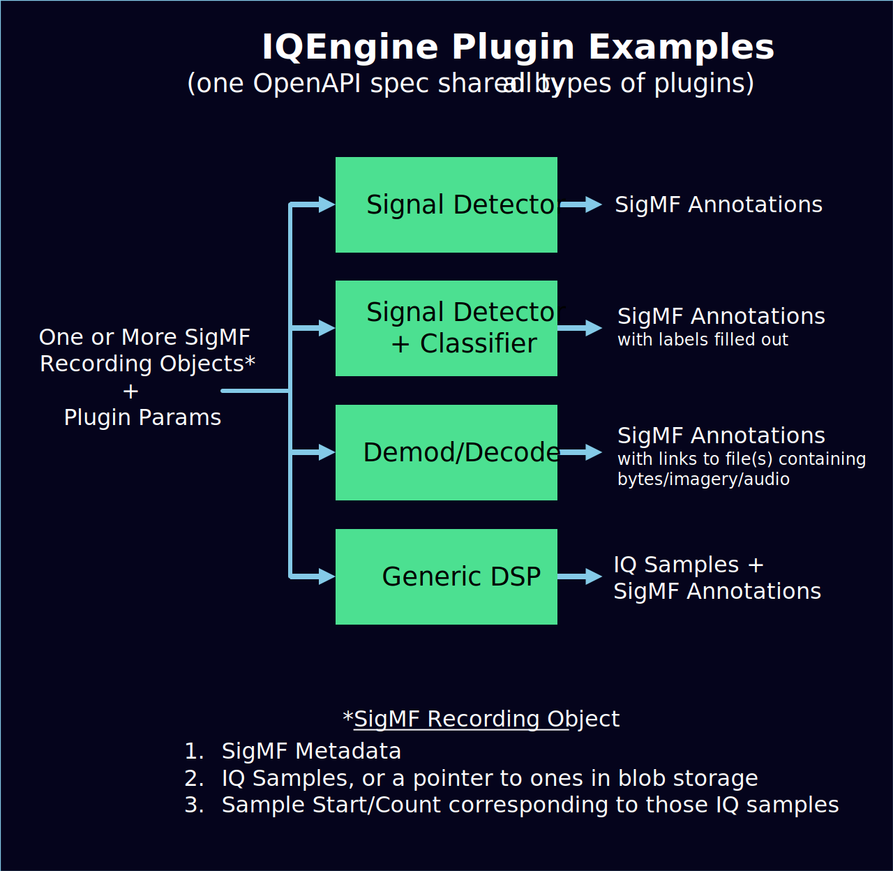

#

<p align="center">
  
</p>

_<p align="center"><a href="https://www.iqengine.org">www.iqengine.org</a></p>_

<h4 style="text-align: center;"><i>A web-based SDR toolkit for analyzing, processing, and sharing RF recordings</i></h4>

* Spectrogram-based visualization and editor tool, built on SigMF
* Share your RF recordings or RFML datasets with others, without them having to download files or install any software
* IQEngine only fetches the portion of the samples you're viewing, allowing you to quickly browse very large RF recordings
* Test signal detection algorithms and visualize results
* Interactively learn about different Fourier and wavelet transforms and filters by applying them to interesting signals
* Organize and search through millions of RF recordings via metadata queries


Try IQEngine now using the canonical instance at [www.iqengine.org](http://iqengine.org/) hosted by [GNU Radio](https://www.gnuradio.org/) and connected to the official [SigMF](https://github.com/gnuradio/SigMF) examples repository.  You can use the same site to open local RF recordings, the processing is all done client-side.

IQEngine is rapidly evolving, so [sign up](https://dashboard.mailerlite.com/forms/299501/77960409531811734/share) for a once-a-month email update, including new features, demos, and more!  There is also an IQEngine [Discord](https://discord.gg/k7C8kp3b76) chat channel if you want to get involved in the development.  You may also contact Marc at iqengine@vt.edu for questions/comments/suggestions.

## Plugins

Through the optional backend API, IQEngine supports three different classes of plugins (signal generation is not yet released).
The signal detector (with optional classifier) can be triggered in the main spectrogram page, which will display the output annotations as soon as it finishes, convenient for testing new detection/classification algorithms.
The DSP module runs prior to the FFT calculations, letting you perform a variety of signal processing functions and other sample manipulation.
It currently only supports Python snippets, where the samples out must be the same length as samples in (for now).

<p align="center">
  
</p>

## Create your own instance
Click the button below to deploy your own instance of IQEngine.
You will need an Azure account, but you can get a free one [here](https://azure.microsoft.com/en-us/free/).  The deployment will take about 5 minutes.

[](https://portal.azure.com/#create/Microsoft.Template/uri/https%3A%2F%2Fraw.githubusercontent.com%2FIQEngine%2FIQEngine%2Fmain%2Finfra%2Fiqengine.json)

## Local Installation

If you only need to work with local files or operate in a sensitive environment, you don't have to run your own instance of IQEngine. The primary instance at [www.iqengine.org](http://www.iqengine.org) can be used to view local files or access your private storage account. However, if you still want to run your own instance, follow these instructions:

### Using the Public Docker Image

You can run the latest Docker image from the GitHub repository by executing the following command:

```bash
docker run -p 3000:3000 -d ghcr.io/iqengine/iqengine:latest
```

Alternatively, if you prefer to run the latest pre-release version from the "main" branch:

```bash
docker run -p 3000:3000 -d ghcr.io/iqengine/iqengine:pre
```

This command will launch IQEngine, and you can access it at [http://localhost:3000](http://localhost:3000).

### Running from Source Code

To run IQEngine from source code, you need to have Node.js and npm installed on your system.
If you don't have them, you can download and install them from [here](https://nodejs.org/en/download/).
Additionally, ensure that you have Python 3.10 or a higher version installed.
You can download and install Python from [here](https://www.python.org/downloads/).
Lastly, you'll need to have "make" installed on your system, which can be obtained from [here](https://www.gnu.org/software/make/).

Once you have Node.js, npm, Python, and make installed, follow these steps:

1. Clone the repository.
2. Install the project dependencies by running the following command:

```bash
make setup
```

3. Start the development server by executing the following command:

```bash
make dev
```

After executing these commands, all the dependencies will be installed, and the development server will start. You can access IQEngine at [http://localhost:3000](http://localhost:3000).

### Running from a Local Docker Build Image

If you prefer to build and run the IQEngine Docker image locally, follow these steps:

1. Clone the repository and navigate to the project directory.
2. Build the Docker image by executing the following command:

```bash
docker build -t iqengine-local .
```

3. Once the image is built successfully, run the Docker container with the following command:

```bash
docker run -p 3000:3000 -d iqengine-local
```

This will instantiate IQEngine using your locally built Docker image, and you can access it at [http://localhost:3000](http://localhost:3000).

### Misc Tips

To fix 99% of linting warnings automatically, try running:

```bash
docker run -d -v $(git rev-parse --show-toplevel):/tmp/lint ghcr.io/oxsecurity/megalinter:v6
```

Feature Flag usage.

Feature flags are set up across the application. To use a feature flag add it to the environment .env and then use it to wrap UI elements as illustrated below, or use the getFeatureFlag(flagname) method to programmatically get a feature flag value.

Each component needs to import the Feature component.

```HTML
      <Feature flag="useIQEngineOutReach">
        <h2 className="text-center py-2">
          Sign up for a once-a-month email update on IQEngine, such as new features, demos, and more!
        </h2>
      </Feature>
```

## Project Configuration

To configure the project, you need to set specific environment variables. The currently supported environment variables are as follows:

* `IQENGINE_CONNECTION_INFO`: This variable contains information about the connection string and data sources. You can refer to the [example.env](example.env) file for an example.

* `IQENGINE_GOOGLE_ANALYTICS_KEY`: This variable holds the key for Google Analytics. If you don't intend to use Google Analytics, you can leave this variable empty.

* `IQENGINE_PLUGINS_ENDPOINT`: Use this variable to specify the endpoint for the detector API. If you don't plan to use the detector API, you can leave this variable empty.

* `IQENGINE_FEATURE_FLAGS`: Use this variable to specify feature flags for the web app. If you have a Metadata database you can specify the `useAPIDatasources` flag like this: IQENGINE_FEATURE_FLAGS = {"useAPIDatasources": false}. Additional feature flags can be added using comma separation.

* `IQENGINE_METADATA_DB_CONNECTION_STRING`: This variable stores the connection string for the Metadata DB. If you don't want to utilize the Metadata DB, you can leave this variable empty. Please note that this variable is only used by the backend API.

* `IN_MEMORY_DB`: This variable switches in-memory DB on or off. The in-memory DB is intended for testing only. Use IN_MEMORY_DB = 0 for off and 1 for on. PyTest tests of the API make use of the in-memory DB.

## Feature Flags

We have several feature flags currently in use. Their purposes are as follows:

* `useIQEngineOutReach`: When true this flag shows IQ Engine outreach links, specifically the Discord and the link to sign up for the monthly IQ Engine email. This is true as default.

* `useAPIDatasources`: When true this flag allows the use and display of API data sources in the RepoBrowser component. This is true as default.

* `displayIQEngineGitHub`: When true this flag shows the link for the IQ Engine GitHub repo. This is true as default.

* `displayInternalBranding`: When true this flag displays an additional logo for customers using IQ Engine. This is false as default.


## Project Roadmap

The following roadmap highlights the past, current, and future work items across multiple (simultaneous) focus areas.  Not included in this list are ongoing efforts to make IQEngine valuable for use in education, as well as user experience (UX) improvements.

* Becoming the best analysis tool for raw RF recordings
  * [x] Spectrogram + time + freq + IQ plots with zooming and adjustable scales
  * [x] Filtering and arbitrary Python snippets prior to FFT
  * [x] Time domain cursors to select samples for other plots or to send to plugins
  * [ ] Frequency domain cursors and ability to extract region to a new file using tune-filter-decimate
  * [ ] Faster client-side FFTs (e.g., using a C webasm module + SIMD for the FFTs)
  * [ ] Configurable colormap
  * [ ] PFB channelizer or wavelet in place of FFT
  * [ ] Time-domain plot utilities like demod, hex viewier, correlator, similar to Universal Radio Hacker
* Becoming the ultimate SigMF visualization and editing tool
  * [x] Viewable/editable global params and annotations, including adding a new annotation
  * [ ] Ability to save changes to annotations/captures/global to the file
  * [ ] If you click an annotation in the table it jumps to that point in time in the spectrogram
  * [ ] Support for multiple captures
  * [ ] Zooming out in time with decimating to reduce data transferred to client
  * [ ] Ability to link to a specific point in time within a recording
  * [ ] Method of converting other common meta and data types to SigMF (e.g., recordings from test equipment)
* Extendable with Plugins (detection, classification, demod/decode, generic DSP)
  * [x] Example proof of concept for running plugins within IQEngine
  * [ ] Finalize and implement OpenAPI spec
  * [ ] Include examples of functioning plugins and templates for authors to follow
  * [ ] Ability for third-party hosted plugins to be made available to anyone
  * [ ] User/admin system for controlling access to certain plugins
* Adding value to RFML research and development
  * [x] A couple example signal detector plugins people can play with and a template
  * [ ] Allow existing RFML implementations to be supported by the IQEngine plugins API without excess work required
  * [ ] Colored annotation boxes
* Utility within spectrum awareness systems
  * [x] Table of all RF recordings available in a directory or blob storage account
  * [x] Spectrogram thumbnails
  * [ ] Ability to search/query over millions of recordings by parsing metadata into database
  * [ ] Maps based interface to show sensor location
  * [ ] Bandwidth stitching of multiple simultaneous recordings at different frequencies
  * [ ] User/admin system for controlling access to certain recordings

* [x] Indicates completed

## Azure App Service Config Notes

* Startup command needs to be `pm2 serve /home/site/wwwroot --spa --no-daemon`
* Node 16
* There needs to be a deployment slot called staging
* within the GitHub repository settings under Secrets and vars > Actions, there needs to be a Repository secret with AZUREAPPSERVICE_PUBLISHPROFILE...
* Connection settings live in GitHub Secrets > Actions (not Azure App Service anymore), enter it in without the outer double quotes and don't escape any quotes.

<p align="center"><h1>IQEngine is Supported By:</h1></p>

<p align="center"></p>

<p align="center"><a href="https://www.qoherent.ai/"></a></p>
