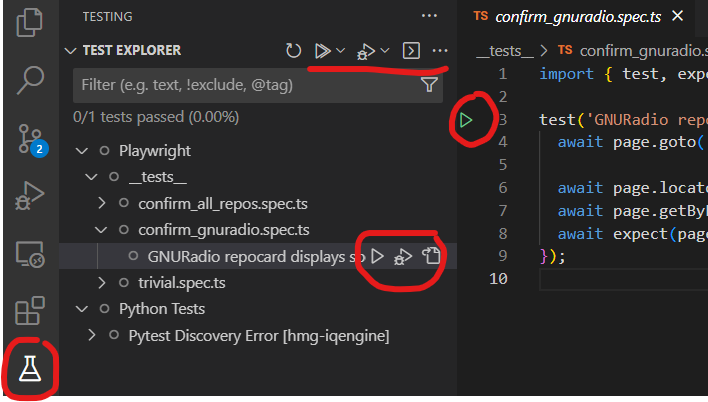

# Integration Tests

## Setup

Install Playwright with the following, tested to work on Ubuntu 22:

```bash
npm install playwright
npx playwright install-deps
```

Export the following before running tests

```bash
export MONGO_USERNAME=somebody
export MONGO_PASSWORD=something
```

Ensure you have an `.env` file in `e2e` that includes the `IQENGINE_METADATA_DB_CONNECTION_STRING`.

## Run

The simplest way to run the tests is just to do:

```bash
cd e2e
npx playwright test
# Or DEBUG=pw:webserver npx playwright test to debug server startup
```

This will start up the necessary API and application servers to run an end-to-end test on all configured browsers. If a server is already
running the tests will try and re-use that rather than start a new one.

See (Playwright Test Cli)(<https://playwright.dev/docs/test-cli>) for full details of command line arguments.

If you need more fine-grained control the project Makefile has targets to help you with that e.g.

```bash
make run-api  # Start the API Server
make dev      # Start the app server
make test-pw  # Run the PlayWright tests
make test     # Run PlayWright tests & pytests
```

The test-pw and test targets build a docker container image of the API + the client app. It then runs that container together with a MongoDB container and runs the tests against the containerized system.

Integration testing is implemented using a couple of tools. For the api, pytest is the tool. For the frontend, the tool is [Playwright](https://playwright.dev/docs/intro).

There is also a VSCode extension available which can run tests from within the editor. See [Getting Started VSCode](https://playwright.dev/docs/getting-started-vscode) for details.

*NB: Seems like a bug but the extension will choose the alphabetically-sorted first config it finds. You may need to set the default
config file to use when running this way*

```html
<p align="center">
  
</p>
```

The highlighted controls trigger running a script, a collection of scripts, debugging of scripts, and so on.
